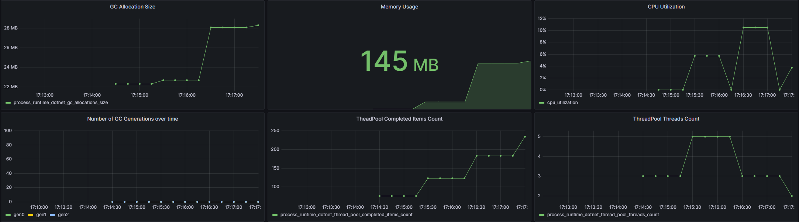

# Dotnet Telemetry

This project was developed to test the best metrics and tracking implementations for dotnet applications, and visual platforms to track request status, issues and track memory and cpu usage.

## Resources used

For this, technologies were used:

- DotNet 7
- EF Core
- InMemory DB
- OpenTelemetry
- Jaeger
- Prometheus
- Grafana
- Seq
- Docker

## OpenTelemetry

OpenTelemetry is an open-source project that aims to provide a set of APIs, libraries, agents, and instrumentation to enable observability in distributed systems. It allows developers to capture traces, metrics, and logs from applications and services, providing insights into the performance and behavior of complex microservices architectures and supports various programming languages and integrates seamlessly with popular frameworks, making it versatile and easy to adopt.

[See the documentation](https://opentelemetry.io/)

## Jaeger

Jaeger is an open-source distributed tracing system designed to help developers monitor and troubleshoot complex microservices architectures. Developed by Uber, it captures and analyzes trace data to provide insights into the interactions between different microservices, helping identify bottlenecks and performance issues.

[See the documentation](https://www.jaegertracing.io/)

<p align="center">
  
</p>

## Prometheus

Prometheus is an open-source monitoring and alerting system widely used in the DevOps and software engineering communities. It collects time-series data from instrumented targets through periodic scraping over HTTP. The data is stored in a time-series database, and users can query, visualize, and analyze the metrics in real-time using its flexible PromQL query language. Prometheus also includes an alerting system that can generate alerts based on user-defined rules and thresholds.

[See the documentation](https://prometheus.io/)

<p align="center">
    
</p>

## Grafana

Grafana is a powerful open-source analytics and visualization platform used to monitor and analyze data in real-time. It supports various data sources like databases, cloud services, and APIs, making it ideal for diverse data environments. With its user-friendly interface, users can create interactive and customizable dashboards, charts, and graphs to display data trends, metrics, and insights.

[See the documentation](https://grafana.com/)

<p align="center">
    
</p>

## Seq

Datalust Seq is a modern and versatile log management solution designed to handle large-scale event data efficiently. It is commonly used for real-time log analysis, monitoring, and visualization. Seq provides developers, DevOps teams, and IT professionals with a centralized platform to collect, process, and analyze log events from various sources.

[See the documentation](https://datalust.co/seq)

<p align="center">
    
</p>

## Test

To run this project you need docker installed on your machine, see the docker documentation [here](https://www.docker.com/).

Having all the resources installed, run the command in a terminal from the root folder of the project and wait some seconds to build project image and download the resources:
`docker-compose up -d`

In terminal show this:

```console
[+] Running 7/7
 ✔ Network dotnet-app_app_network     Created          0.8s
 ✔ Container seq                      Started          2.6s
 ✔ Container jaeger                   Started          5.8s
 ✔ Container otel-collector           Started          4.2s
 ✔ Container test_application         Started          6.1s
 ✔ Container dotnet-app-prometheus-1  Started          7.3s
 ✔ Container dotnet-app-grafana-1     Started          8.3s
```

After this, access the link below:

- Swagger project [click here](http://localhost:5000/swagger)
- Jaeger portal [click here](http://localhost:16686/search)
- Prometheus portal [click here](http://localhost:9090/)
- Grafana portal [click here](http://localhost:3000/dashboards)
- Seq Logs portal [click here](http://localhost:5341/#/events)

### Stop Application

To stop, run: `docker-compose down`

## Implementation

To implement the same configuration in your application see below

### Dotnet packages used

In [nuget](https://www.nuget.org/) get the packages

- OpenTelemetry
- OpenTelemetry.Exporter.Jaeger
- OpenTelemetry.Exporter.OpenTelemetryProtocol
- OpenTelemetry.Exporter.OpenTelemetryProtocol.Logs
- OpenTelemetry.Extensions.Hosting
- OpenTelemetry.Instrumentation.AspNetCore
- OpenTelemetry.Instrumentation.Http
- OpenTelemetry.Instrumentation.Process
- OpenTelemetry.Instrumentation.Runtime

---

### Configure Tracing

```c#
services.AddOpenTelemetry()
    .WithTracing(options =>
    {
        options
            .SetResourceBuilder(ResourceBuilder.CreateDefault().AddService("ApplicationName"))
            .AddAspNetCoreInstrumentation()
            .AddHttpClientInstrumentation()

            .SetSampler(new AlwaysOnSampler())
            .AddJaegerExporter(jaegerOptions =>
            {
                jaegerOptions.AgentHost = configuration["Jaeger:Url"] ?? throw new InvalidOperationException();
                jaegerOptions.AgentPort = int.Parse(configuration["Jaeger:Port"] ?? throw new InvalidOperationException());
            })
            .AddOtlpExporter(o => o.Endpoint = new Uri(configuration["Otlp:Endpoint"] ?? throw new InvalidOperationException()));
    })
```

---

### Configure Metrics

```c#
services.AddOpenTelemetry()
    .WithMetrics(options =>
    {
        options
            .SetResourceBuilder(ResourceBuilder.CreateDefault().AddService("ApplicationName"))
            .AddAspNetCoreInstrumentation()
            .AddHttpClientInstrumentation()
            .AddRuntimeInstrumentation()
            .AddProcessInstrumentation()
            .AddOtlpExporter(o => o.Endpoint = new Uri(configuration["Otlp:Endpoint"] ?? throw new InvalidOperationException()));
    });
```

---

### Configure Logs

```c#
services.AddLogging(logging => logging.AddOpenTelemetry(openTelemetryLoggerOptions =>
    {
        openTelemetryLoggerOptions.IncludeScopes = true;
        openTelemetryLoggerOptions.IncludeFormattedMessage = true;
        openTelemetryLoggerOptions.ParseStateValues = true;

        openTelemetryLoggerOptions.AddOtlpExporter(exporter =>
        {
            exporter.Endpoint = new Uri(configuration["Otlp:Endpoint"] ?? throw new InvalidOperationException());
        });
    })
    .SetMinimumLevel(LogLevel.Debug));
```

---

### In appsettings.json add

```json
  "Otlp": {
    "Endpoint": "http://localhost:4317"
  },
  "Jaeger": {
    "Url": "localhost",
    "Port": 6831
  }
```

---

### Configure Prometheus

Create prometheus.yml and add configuration in docker-compose file

```yml
global:
  scrape_interval: 10s
  evaluation_interval: 10s

scrape_configs:
  - job_name: "otel-collector"
    static_configs:
      - targets: ["otel-collector:8889"]
      - targets: ["otel-collector:8888"]
```

---

### Configure OpenTelemetry Collector

Create otel-collector-config.yml and add configuration in docker-compose file

```yml
receivers:
  otlp:
    protocols:
      grpc:
      http:

exporters:
  prometheus:
    endpoint: 0.0.0.0:8889

  logging:

  otlphttp/jaeger:
    endpoint: "http://jaeger:4318"
    tls:
      insecure: true

  otlphttp/seq:
    endpoint: "http://seq:5341/ingest/otlp"
    tls:
      insecure: true

processors:
  batch:

extensions:
  health_check:

service:
  extensions: [health_check]
  pipelines:
    traces:
      receivers: [otlp]
      processors: [batch]
      exporters: [logging, otlphttp/jaeger]

    metrics:
      receivers: [otlp]
      processors: [batch]
      exporters: [logging, prometheus]

    logs:
      receivers: [otlp]
      processors: [batch]
      exporters: [logging, otlphttp/seq]
```

---

### Grafana

Get files in folder `grafana` and copy to your project

---

### Create docker-file

```yaml
version: "3.4"
name: dotnet-app

services:
  # Start: Configure your application here
  backend:
    build:
      context: ./src/Dotnet.Telemetry.Jaeger.Api
      dockerfile: Dockerfile
    container_name: test_application
    ports:
      - "5000:80"
    environment:
      Otlp__Endpoint: http://otel-collector:4317
      Jaeger__Url: jaeger
      Jaeger__Port: 6831
    depends_on:
      - otel-collector
    networks:
      - app_network
  # End: Configure your application here

  jaeger:
    image: jaegertracing/all-in-one:1.35
    container_name: jaeger
    volumes:
      - "./jaeger-config/jaeger-ui.json:/etc/jaeger/jaeger-ui.json"
    command: --query.ui-config /etc/jaeger/jaeger-ui.json
    ports:
      - "5775:5775/udp"
      - "6831:6831/udp"
      - "6832:6832/udp"
      - "5778:5778"
      - "16686:16686"
      - "14268:14268"
      - "9411:9411"
    environment:
      - COLLECTOR_OTLP_ENABLED=true
      - METRICS_STORAGE_TYPE=prometheus
      - PROMETHEUS_SERVER_URL=http://prometheus:9090
      - LOG_LEVEL=debug
      - PROMETHEUS_QUERY_SUPPORT_SPANMETRICS_CONNECTOR=true
      - PROMETHEUS_QUERY_NAMESPACE=span_metrics
      - PROMETHEUS_QUERY_DURATION_UNIT=s
    networks:
      - app_network

  prometheus:
    image: prom/prometheus:v2.29.2
    volumes:
      - ./prometheus/prometheus.yml:/etc/prometheus/prometheus.yml
    ports:
      - "9090:9090"
    depends_on:
      - backend
    networks:
      - app_network

  otel-collector:
    image: otel/opentelemetry-collector-contrib:0.61.0
    container_name: otel-collector
    volumes:
      - ./otel-collector/otel-collector-config.yml:/etc/otel/config.yaml
    command: --config /etc/otel/config.yaml
    ports:
      - "8888:8888"
      - "8889:8889"
      - "13133:13133"
      - "4317:4317"
    networks:
      - app_network

  grafana:
    image: grafana/grafana:9.4.3
    depends_on:
      - prometheus
    ports:
      - 3000:3000
    networks:
      - app_network
    volumes:
      - ./grafana/provisioning/:/etc/grafana/provisioning/
      - ./grafana/dashboards/:/var/lib/grafana/dashboards

  seq:
    container_name: seq
    image: datalust/seq:preview
    ports:
      - "5341:80"
      - "5342:5342"
      - "45341:45341"
    environment:
      - ACCEPT_EULA=Y
    networks:
      - app_network

networks:
  app_network:
```
